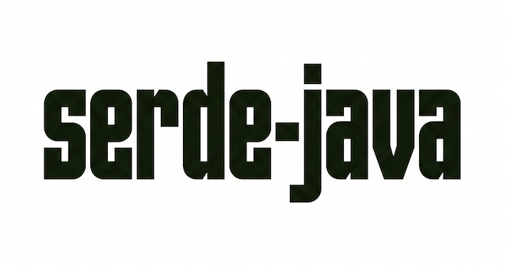

# serde-java

A Rust implementation of the [Java Object Serialization Stream Protocol][spec] — the byte format produced by
`java.io.ObjectOutputStream` (magic `AC ED 00 05`).

It lets Rust code emit byte streams that a stock JVM can read back with `ObjectInputStream`, with **no JVM and no JNI
involved**. Useful when a Rust service has to talk to something that only speaks Java serialization: an RPC endpoint, a
cache, a message payload, a persisted blob.

> **Status: early (`0.0.1`), write-only.** There is no deserializer — this crate encodes Rust values *into* the Java
> format, it does not decode Java streams. See [Limitations](#limitations).

## Install

Not published to crates.io yet. Depend on it by git or path:

```toml
[dependencies]
serde-java = { git = "<repo-url>" }
```

Requires a Rust toolchain supporting edition 2024.

## Quick start

Given this Java class:

```java
package com.example;

public class Demo implements Serializable {
  private static final long serialVersionUID = 5151422842377556126L;

  private int i;
  private String message;
}
```

Describe its shape in Rust and serialize:

```rust
use once_cell::sync::Lazy;
use serde_java::*;

struct Demo {
    i: i32,
    message: String,
}

impl JavaObject for Demo {
    fn class() -> Class {
        static CLASS: Lazy<Class> = Lazy::new(|| {
            Class::builder("com.example.Demo", 5151422842377556126)
                .field(Field::builder("i").int())
                .field(Field::builder("message").string())
                .build()
        });
        Clone::clone(&CLASS)
    }
}

impl JavaSerializable for Demo {
    fn fields(&self) -> Vec<FieldValue<'_>> {
        vec![FieldValue::Int(self.i), FieldValue::String(&self.message)]
    }
}

fn main() -> std::io::Result<()> {
    let demo = Demo { i: 42, message: "helloWorld".to_string() };

    let bytes = demo.to_bytes()?;   // Vec<u8>, byte-identical to ObjectOutputStream
    demo.to_file("demo.ser")?;      // or straight to disk

    Ok(())
}
```

`bytes` is exactly what a JVM writes for the same object:

```
aced0005                                          // stream header
73 72 0010 636f6d2e6578616d706c652e44656d6f       // TC_OBJECT, TC_CLASSDESC, "com.example.Demo"
477d87c81fbf509e 02 0002                          // serialVersionUID, SC_SERIALIZABLE, 2 fields
49 0001 69                                        // int i
4c 0007 6d657373616765 7400124c6a…537472696e673b  // String message, "Ljava/lang/String;"
78 70                                             // TC_ENDBLOCKDATA, null superclass
0000002a 74000a68656c6c6f576f726c64               // 42, "helloWorld"
```

Feed that to an `ObjectInputStream` and you get a real `com.example.Demo` back.

Two traits do the work:

- **`JavaObject::class()`** — the *schema*: the Java class's name, `serialVersionUID`, and ordered field list. Build it
  once in a `static Lazy<Class>`; `Class` is `Arc`-backed, so handing out clones is cheap.
- **`JavaSerializable::fields()`** — the *instance*: one `FieldValue` per field, in the same order as the schema.

`to_bytes()` / `to_file()` come free via the blanket `JavaSerializableExt` impl. For streaming into an arbitrary
`io::Write`, use `JavaWriter::new(w)` plus `write_to(&mut w, &obj)` directly.

## `#[derive(JavaSerialize)]`

For a plain struct with named fields, you don't have to hand-write `JavaObject`/`JavaSerializable` at all —
`#[derive(JavaSerialize)]` (on by default via the `derive` feature) generates both impls, with fields sorted into the
primitive-then-alphabetical order Java expects:

```rust
use serde_java::*;

#[derive(JavaSerialize)]
#[java(class = "com.example.Demo", serial_version_uid = 5151422842377556126)]
struct Demo {
    i: i32,
    message: String,
}
```

This produces the same byte stream as the hand-written `Demo` above. Both container attributes are required — the
`serial_version_uid` can't be derived from the Rust side, since Java's default algorithm hashes method and
constructor signatures that don't exist in Rust.

Field attributes:

- `#[java(rename = "...")]` — changes the Java-side field name (and therefore its sort position)
- `#[java(skip)]` — Java `transient`; omitted from both schema and value
- `#[java(signature = "...")]` — overrides the declared descriptor signature only; the value side still follows the
  Rust type

Supported field types: the Java primitives (`bool`, `i8`, `u8`, `u16`, `i16`, `i32`, `i64`, `f32`, `f64`),
`String`/`&str`, primitive arrays (`Vec<u8|i16|i32|i64|f32|f64>` or the equivalent `&[T]` slices), object arrays
(`Vec<T>`), `Option<T>` for non-primitive `T`, and nested types implementing `JavaObject`. Struct lifetime
parameters are fine; type/const generics, tuple/unit structs, enums, and unions are rejected at compile time, as are
`char`, the wider integer types (`u32`/`u64`/`usize`/`isize`/`i128`/`u128`), `Vec<String>`/`Vec<bool>`/`Vec<u16>`,
`Option<primitive>`, and doubly-nested collections (`Vec<Vec<T>>`, `Vec<Option<T>>`, `Option<Option<T>>`). Every
rejection is a compile-time `syn::Error` at the offending span, not a runtime surprise.

## Field order is not declaration order

This is the single easiest thing to get wrong. `ObjectStreamClass` sorts fields the way the JVM does: **all primitive
fields first, then all object/array fields, each group sorted alphabetically by name.** Your `Class` builder must list
them in *that* order, not in the order the Java source declares them.

So this Java class:

```java
public class User implements Serializable {
  private long id;
  private String name;
  private int age;
  private Address[] addresses;
  private ExtInfo ext1;
  private ExtInfo ext2;
}
```

is described in Rust as `age`, `id` (primitives, alphabetical), then `addresses`, `ext1`, `ext2`, `name` (objects,
alphabetical):

```rust
Class::builder("com.example.User", 4956385333250593913)
    .field(Field::builder("age").int())
    .field(Field::builder("id").long())
    .field(Field::builder("addresses").array(Address::class().signature()))
    .field(Field::builder("ext1").object("Lcom/example/ExtInfo;"))
    .field(Field::builder("ext2").object("Lcom/example/ExtInfo;"))
    .field(Field::builder("name").string())
    .build()
```

`fields()` must then return values in that same order. Nothing validates this — not the count, not the order, not the
types. A mismatch yields a stream the JVM rejects or, worse, silently mis-binds. See `examples/example.rs` and
`examples/example.java` for the full paired version, and run it with:

```sh
RUST_LOG=info cargo run --example example
```

## Computing `serialVersionUID`

Every schema needs a `serial_version_uid`. The easy path is to read it off the Java class (`private static final long
serialVersionUID`) or run `serialver com.example.Demo`. When the Java class *doesn't* declare one, the JVM derives it
from the class's structure — and the receiving `ObjectInputStream` will reject the stream unless your Rust side
produces the exact same number.

`suid::compute_default_suid` reproduces that derivation. You describe the Java class the way `ObjectStreamClass` sees
it — name, modifiers, interfaces, fields, constructors, methods — and it returns the same `i64` the JVM would compute:

```rust
use serde_java::suid::*;

let meta = ClassMetadata {
    class_name: "com.example.ExtInfo",
    class_modifiers: PUBLIC,
    is_interface: false,
    interfaces: vec!["java.io.Serializable"],
    fields: vec![
        FieldSig { name: "id",    modifiers: PRIVATE, type_sig: "I" },
        FieldSig { name: "key",   modifiers: PRIVATE, type_sig: "Ljava/lang/String;" },
        FieldSig { name: "value", modifiers: PRIVATE, type_sig: "Ljava/lang/String;" },
    ],
    has_static_initializer: false,
    constructors: vec![
        MethodSig { name: "<init>", modifiers: PUBLIC, descriptor: "()V" },
        MethodSig { name: "<init>", modifiers: PUBLIC,
                    descriptor: "(ILjava/lang/String;Ljava/lang/String;)V" },
    ],
    methods: vec![
        MethodSig { name: "getId",    modifiers: PUBLIC, descriptor: "()I" },
        MethodSig { name: "getKey",   modifiers: PUBLIC, descriptor: "()Ljava/lang/String;" },
        MethodSig { name: "getValue", modifiers: PUBLIC, descriptor: "()Ljava/lang/String;" },
    ],
};

assert_eq!(650544313874690833, compute_default_suid(&meta));
```

The algorithm follows the [spec][suid-spec]: write the class name, the masked class modifiers, the sorted interface
names, the surviving fields, `<clinit>`, the constructors and the methods into one `DataOutputStream`-style buffer
(2-byte length + modified UTF-8 per string, big-endian `i32` per modifier set), SHA-1 it, then fold the first 8 bytes
back **little-endian** into an `i64`. The fiddly parts it handles for you:

- **Modifier masking.** Only `PUBLIC | FINAL | INTERFACE | ABSTRACT` count for the class; fields keep
  `PUBLIC | PRIVATE | PROTECTED | STATIC | FINAL | VOLATILE | TRANSIENT`; methods and constructors keep
  `PUBLIC | PRIVATE | PROTECTED | STATIC | FINAL | SYNCHRONIZED | NATIVE | ABSTRACT | STRICT`.
- **Interface `ABSTRACT` fixup.** For an interface, `ABSTRACT` is forced on when it declares methods and cleared when
  it doesn't.
- **Filtering.** `private static` and `private transient` fields are dropped, as are all `private` constructors and
  methods.
- **Sort order.** Interfaces by name; fields by name; constructors by descriptor; methods by name then descriptor.
- **Descriptor rewriting.** Constructor and method descriptors are hashed with `/` replaced by `.`, matching the JVM.

Modifier constants (`PUBLIC`, `PRIVATE`, `STATIC`, `TRANSIENT`, …) are plain `i32`s in the same module, meant to be
OR'd together: `modifiers: PUBLIC | STATIC | FINAL`.

Two caveats. First, this is *your* description of the Java class, not reflection over a real one — if you forget a
Lombok-generated `equals`/`hashCode`/`toString` or get a descriptor wrong, you get a different (wrong) UID with no
warning. Cross-check against `serialver` when you can. Second, the module is declared `mod suid;` in `src/lib.rs`, so
it is currently **internal** — make it `pub mod suid;` (or re-export the items) before using it from another crate.

## Type mapping

| Java              | Schema (`Field::builder(name)`) | Value (`FieldValue`)     |
| ----------------- | ------------------------------- | ------------------------ |
| `boolean`         | `.boolean()`                    | `Bool(bool)`             |
| `byte`            | `.byte()`                       | `Byte(u8)`               |
| `char`            | `.char()`                       | `Char(u16)`              |
| `short`           | `.short()`                      | `Short(i16)`             |
| `int`             | `.int()`                        | `Int(i32)`               |
| `long`            | `.long()`                       | `Long(i64)`              |
| `float`           | `.float()`                      | `Float(f32)`             |
| `double`          | `.double()`                     | `Double(f64)`            |
| `String`          | `.string()`                     | `String(&str)`           |
| `Foo`             | `.object("Lcom/example/Foo;")`  | `Object(Class, &dyn ..)` |
| `int[]` etc.      | `.int_array()`, …               | `IntArray(&[i32])`, …    |
| `Foo[]`           | `.array(Foo::class().signature())` | `Array(Class, Vec<..>)` |
| `null`            | —                               | `Null`                   |

Nested objects, object arrays, and `null` references all work. Strings are written as Java **modified UTF-8**, and
repeated strings and class descriptors are emitted as `TC_REFERENCE` back-references, matching what the JVM does.

Pre-built descriptions of common JDK types live in `serde_java::ext` (currently `Throwable` and `StackTraceElement`).

## Limitations

- **No deserialization.** Write-only; there is no reader for Java streams.
- **No object-identity dedup.** Handles are allocated per object but never reused, so one Rust value referenced twice
  serializes as two distinct Java objects rather than a back-reference. Cyclic graphs are not supported.
- **`FieldValue::BoolArray`, `CharArray`, and `StringArray` are unimplemented** and will panic (`todo!()`). Other
  primitive arrays and object arrays work.
- **Custom `writeObject` (`ClassFlags::WRITE_METHOD`) is barely exercised** — the hook exists on `JavaSerializable`,
  but no type in the tree uses it and the block-data framing around it is incomplete.
- **`ext::Throwable` is partial** — it writes `detailMessage` and `cause`, but not `stackTrace` or
  `suppressedExceptions` (its round-trip test is `#[ignore]`d for that reason). `StackTraceElement` is complete.
- **`suid` is not exported.** `compute_default_suid` and friends live behind a private `mod suid;`, so they are only
  reachable from inside the crate today.
- **The derive macro covers common cases only.** `#[derive(JavaSerialize)]` doesn't support generic structs, enums,
  tuple/unit structs, superclass chains, or `ClassFlags::WRITE_METHOD`; for those, schema/value agreement is on the
  caller via the hand-written path (see [Field order is not declaration order](#field-order-is-not-declaration-order)).
  There is still no reflection — Rust has no runtime access to a real Java class's shape.

## Development

```sh
cargo build
cargo test --lib                       # all tests
cargo test --lib test_serialize_nested # one test
RUST_LOG=debug cargo test --lib -- --nocapture
```

Tests assert against hex fixtures captured from a real `ObjectOutputStream` — the fixture is the spec. If encoder
output stops matching, regenerate the fixture from a JVM rather than editing it to match the new bytes.

## License

Apache-2.0. See [LICENSE](LICENSE).

[spec]: https://docs.oracle.com/javase/8/docs/platform/serialization/spec/protocol.html
[suid-spec]: https://docs.oracle.com/javase/8/docs/platform/serialization/spec/class.html#a4100
